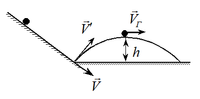

**27.2.** Тело брошено вертикально вверх со скоростью \\(V_{0}\\) = 49 м/с.
На какой высоте *h* его кинетическая энергия будет равна потенциальной?
Ускорение свободного падения *g* = 9,8 \\(м/с^{2}\\). Потенциальную энергию в
точке старта примите равной нулю.

**Решение.** Пренебрегая сопротивлением воздуха, запишем закон
сохранения механической энергии:

$$\frac{mV_0^2}{2}=\frac{mV^{2}}{2}+mgh.\tag{10}$$

Здесь *m* - масса тела, *h* - искомая высота, *V* -
скорость тела на высоте *h*. По условию задачи на этой высоте

$$\frac{mV^{2}}{2}=mgh.$$

Тогда из (10) имеем

$$\frac{mV_0^2}{2}=2mgh.$$

Откуда \\(h=\frac{V_0^2}{4g}\approx61\\) м. Найденная высота оказалась в два раза
меньше максимальной высоты подъема камня над поверхностью земли \\(h_{max}=\frac{V_0^2}{2g}.\\)

**27.5.** С вершины гладкой наклонной плоскости высотой *H* = 20 см
соскальзывает брусок. Определите скорость *V* бруска в конце плоскости.
Ускорение свободного падения *g* = 10 \\(м/с^{2}\\). Начальная скорость равна
нулю.

**Решение.** Примем основание горки за нулевой уровень потенциальной
энергии. Поскольку трение отсутствует, механическая энергия бруска
сохраняется. Приравнивая значения механической энергии на вершине горки
и у ее основания, получим

$$0+mgh=\frac{mV^{2}}{2}+0.$$

Отсюда находим скорость бруска у основания плоскости:

$$V=\sqrt{2gh}= 20 м/с.$$

**27.6.** Шайба с нулевой начальной скоростью скользит с высоты *H* по
гладкой наклонной плоскости, образующей угол α с горизонтом. В конце
наклонной плоскости она встречает гладкую горизонтальную плоскость.
Найдите максимальную высоту *h* подъема шайбы после абсолютно упругого
удара о горизонтальную плоскость.

 

**Решение.** После отскока шайба будет двигаться
по параболе (см. рис. 8) Для определения искомой высоты *h* проще всего
воспользоваться законом сохранения механической энергии. На высоте *h*
скорость шайбы имеет только горизонтальную составляющую
\\(\overrightarrow{V_{Г}}\\). Приравнивая значения механической энергии в
двух точках - на высоте *H* и в вершине параболы на высоте *h* -
получим уравнение

$$0+mgh=\frac{mV_Г^2}{2}+mgh.$$

Величина скорости шайбы у основания наклонной плоскости равна
\\(V=\sqrt{2gh}\\) (см. предыдущую задачу), а горизонтальная
составляющая скорости \\(V_Г=\sqrt{2gh}cosα\\) при отскоке не
изменяется. Следовательно, \\(h=Hsin^{2}\alpha.\\)
