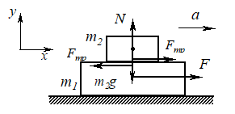
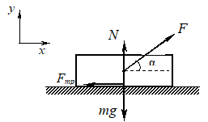
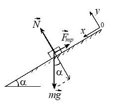
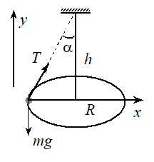

**15.14.** Брусок 1 массой $m_{1}$ находится на
гладкой горизонтальной плоскости. На бруске лежит тело 2 массой $m_{2}$.
Коэффициент трения между телом и бруском μ. При какой величине *F* силы,
приложенной к бруску в горизонтальном направлении, тело начнет скользить
по бруску? Ускорение свободного падения *g .*

**Решение.** Рассмотрим ситуацию «на грани проскальзывания»: тело и
брусок еще движутся как одно целое, но сила трения покоя между ними уже
достигла своего максимального значения

$$F_{тр} =μN. \tag{5}$$

 

Удобно начать рассмотрение с тела, поскольку оно движется только под
действием силы трения. Запишем второй закон Ньютона в проекции на оси
выбранной системы координат (см. рис. 4):

$$m_{2}a=F_{тр},$$

$$0=N-mg. \tag{6}$$

Из (5) и (6) получаем $F_{тр}=μm_{2}g,$ откуда *a =* µ*g*. Именно
при этом ускорении системы тело начнет скользить по бруску. Для
определения силы *F* можно записать второй закон Ньютона для бруска
(надо учесть, что на брусок со стороны тела действует сила трения,
направленная «назад» и равная, в соответствии с третьим законом Ньютона,
$μm_{2}g$). Но проще записать второй закон Ньютона для всей системы:

$$F=(m_{1}+m_{2})a=μ(m_{1}+m_{2})g.$$

**15.15.** К санкам массой $m = (10⋅\sqrt{3}+1)$ кг,
покоящимся на горизонтальной плоскости, приложили силу $\overrightarrow{F},$  составляющую с горизонтом угол $α = 30^{\circ}$.
Вычислите минимальную величину этой силы, достаточную для начала
движения санок. Коэффициент трения скольжения μ = 0,1. Ускорение
свободного падения *g* = 10 $м/с^{2}$.

 

**Решение.** Величина приложенной к санкам силы
будет минимальна, если движение санок равномерное. Учитывая это, запишем
уравнение движения санок:

$$\overrightarrow{F}+m\overrightarrow{g}+\overrightarrow{F_{тр}}+\overrightarrow{N}=0.$$

Здесь $\overrightarrow{F_{тр}}$ - сила трения, $\overrightarrow{N}$ - нормальная составляющая реакции опоры. В соответствии с законом
Амонтона-Кулона
$$F_{тр} =μN. \tag{7}$$
Записывая проекции уравнения движения на оси координат, получим

$$Fcosα-F_{тр}=0,$$
$$Fsinα+N-mg=0.\tag{8}$$

Из (7) и (8) находим величину силы $\overrightarrow{F}$:

$$F=\frac{μmg}{cosα+μsinα} = 20 Н.$$

**15.37.** Угол наклона плоскости доски к
горизонту $α = 30^{\circ}$. На доску положили кирпич массой *m* = 2 кг.
Коэффициент трения скольжения кирпича по доске μ = 0,8. Найдите величину
$F_{тр}$ силы трения, действующей на кирпич. Ускорение свободного падения
*g* = 10 $м/с^{2}$.

 

**Решение.** Исходя из соображений удобства, выберем систему координат
так, как показано на рисунке. Изобразим все силы, действующие на кирпич.
Прежде всего выясним, движется ли кирпич по наклонной плоскости. Если
движется, то для нахождения силы трения скольжения можно воспользоваться
законом Амонтона - Кулона (7)

$$F_{тр} =μN.$$

Если же кирпич не движется, то на него действует сила трения покоя.

Предположим, что кирпич движется вдоль наклонной плоскости с ускорением $\overrightarrow{a}$. Запишем второй закон Ньютона в проекции на оси выбранной системы координат:

$$ma=mgsinα-F_{тр},$$
$$0=N-mgcosα. \tag{9}$$

Здесь учтено, что $a_{x} = a,$  $a_{y} = 0$. Из (9) определяем модуль нормальной составляющей реакции опоры:$N=mgcosα$. 
Тогда $F_{тр} = μmgcosα ≈$ 13,6 Н. С
другой стороны, сила, которая вызывает движение кирпича по наклонной
плоскости, - это со­ставляющая силы тяжести $\overrightarrow{F}$
вдоль оси $Ox$ (вдоль по­верхности соприкосновения тела и наклонной плоскости). Модуль этой
составляющей равен $F=mgsinα$ = 9,8 Н.
Следовательно, $F<F_{тр}.$ Это означает, что предположение о движе­нии кирпича было неверным. Кирпич покоится относительно наклонной плоскости, и на него действует *сила трения покоя,* равная по модулю
составляющей силы тяжести вдоль оси $Ox$, то есть $F_{тр}=F=mgsinα$ = 9,8 Н.
Направление силы трения покоя показано на рисунке. Найденная сила трения приложена к кирпичу. Заметим, что по третьему закону Ньютона такая же по модулю, но противоположная по направлению, сила трения покоя действует на наклонную плоскость, и приложена она к наклонной плос­кости.

**20.16.** Груз на нити описывает в горизонтальной плоскости окружность радиусом *R* = 10 см. Частота обращения груза *n* = 1 об/с. Какой угол α образует нить с вертикалью? Ускорение свободного падения *g =* 9,8 $м/с^{2}$.

 

**Решение.** Уравнение движения груза в проекциях на горизонтальную
(направленную к центру окружности) и вертикальную оси имеет вид

$$Tsinα=4π^{2}mn^{2}R,$$
$$Tcosα-mg=0,$$
где *m* - масса груза, *T* - сила натяжения нити. Исключая из этих
уравнений силу натяжения нити, получаем
$$tgα=\frac{4π^{2}n^{2}R}{g}.$$
В результате имеем $$α=arctg(\frac{4π^{2}n^{2}R}{g})\approx0,4.$$
