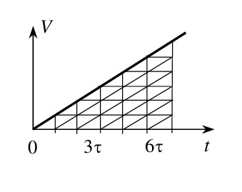

Решения избранных задач из сборника "Задачи по элементарной физике". Кинематика. Часть 1
----  
  **2.7.** За третью секунду равноускоренного движения с начальной скоростью равной нулю тело проходит *s*3 = 20 м. Найдите длину *L* пути за первые *T* = 5 с движения.

**Решение.** Из графика зависимости модуля скорости тела от времени видно, что пути, проходимые за 1-ую, 2-ую…5-ую секунды, относятся как 1:3:5:7:9.

 

Следовательно, 

$${s_3} = 5{s_1} = 5 \cdot \frac{{a{\tau ^2}}}{2}, \tag{1}$$

где *s*1 – путь, пройденный за 1-ую секунду, *a* – ускорение тела, *&tau;* = 1 с. Путь, пройденный за время *T*, 

$$L = \frac{{a{T^2}}}{2},$$

или, с учетом (1),

$$L = \frac{{{s_3}{T^2}}}{{5{\tau ^2}}} = 100 м.$$
  
**5.1.** Камень брошен вертикально вверх. На некоторой высоте камень оказывается через *t*1 = 1 с и *t*2 = 3 с после старта. Определите начальную скорость *V*0 камня. Ускорение свободного падения *g* = 10 м/с2.

**Решение.** В системе отсчета, связанной с Землей, движение камня является равноускоренным. Направим координатную ось *y* вертикально вверх, поместив ее начало на поверхность Земли. Тогда координата *y* тела меняется со временем по закону 

$$y = {V_0}t - \frac{{g{t^2}}}{2}.$$

Запишем это равенство для моментов времени *t*1 и *t*2:

$${y_1} = {V_0}{t_1} - \frac{{gt_1^2}}{2},$$

$${y_2} = {V_0}{t_2} - \frac{{gt_2^2}}{2}.$$

Принимая во внимание, что ${y_1} = {y_2}$,  получим
$${V_0}{t_1} - \frac{{gt_1^2}}{2} = {V_0}{t_2} - \frac{{gt_2^2}}{2},$$  
  
или

$${V_0} = \frac{{g({t_1} + {t_2})}}{2}= 20 м/с.$$

**5.18.** Тело свободно падает с нулевой начальной скоростью с высоты *H* = 45 м. Найдите среднюю скорость <*V*> падения на нижней половине пути. Ускорение свободного падения *g* = 10 м/с2.

<b>Решение.</b> По определению средняя скорость \\(< V > {\rm{ }} = l/t\\), где <i>l</i> – путь,  <i>t –</i> время, за которое этот путь пройден. Пусть <i>t1 -</i> время, затраченное на первую половину пути, <i>t2 –</i> полное время падения тела, тогда время движения тела на нижней половине пути $t = {t_2} - {t_1}$.  Времена <i>t1</i> и <i>t2</i> могут быть найдены из соотношений

$$H = \frac{{gt_2^2}}{2}  \ и \ \frac{H}{2} = \frac{{gt_1^2}}{2}.$$  
 По условию задачи $l = H/2$.  Окончательно получаем 

$ < V >  = \frac{H}{{2({t_2} - {t_1})}} = \frac{{(\sqrt 2  + 1)}}{2}\sqrt {gH} $= 25,6 м/с.

**5.32.** Тело брошено вертикально вверх с начальной скоростью *V*0 = 3,13 м/с. Когда оно достигло наибольшей высоты подъема, из той же точки с такой же начальной скоростью брошено второе тело. На каком расстоянии *s* от точки старта встретятся тела? Ускорение свободного падения *g* = 9,8 м/с2. 

**Решение.** Направим координатную ось *y* вертикально вверх, поместив ее начало в точку бросания. Запишем зависимость координаты *y* каждого тела от времени, отсчитывая время от момента броска второго тела:

$${y_1} = {h_0} - \frac{{g{t^2}}}{2}, {y_2} = {V_0}t - \frac{{g{t^2}}}{2}.$$

Здесь ${h_0} = \frac{{V_0^2}}{{2g}}$   – высота, на которой находилось первое тело в момент броска второго. Условие встречи тел имеет вид
$${y_1} = {y_2}.$$  
Подставляя в последнюю формулу выражения для *y*1 и  *y*2, находим время встречи тел:

$$t = \frac{{{h_0}}}{{{V_0}}} = \frac{{{V_0}}}{{2g}}.$$

Чтобы определить расстояние *s* от точки старта до места встречи тел, надо подставить это время в формулу для *y*1 (или для *y*2). В результате получаем

$$s = \frac{{3V_0^2}}{{8g}} \approx 0,375 м.$$

**Замечание.** Выражение для времени встречи  $t = \frac{{{h_0}}}{{{V_0}}}$ имеет такой вид, как если бы сближение тел происходило равномерно со скоростью *V*0. Это не случайно: относительное движение двух тел, ускорения которых  одинаковы, действительно является равномерным. Например, если оба тела (как в рассматриваемой задаче) совершают свободное движение в поле тяжести, то ускорение одного тела относительно другого равно  ${\vec a_{12}} = {\vec a_1} - {\vec a_2} = \vec g - \vec g = 0$.  
