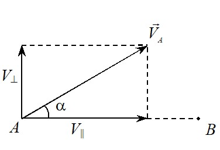
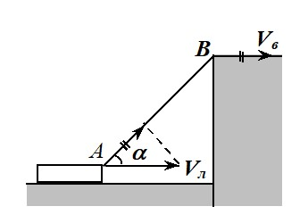

Решения избранных задач из сборника "Задачи по элементарной физике". Кинематика. Часть 2
---
**7.4.**  Эскалатор поднимает неподвижно стоящего на нем пассажира в течение *t*1 = 1 мин. По неподвижному эскалатору пассажир поднимается за *t*2 = 3 мин. Сколько времени *t*3 будет подниматься идущий вверх пассажир по движущемуся вверх эскалатору?

**Решение.** Пусть *l –* длина эскалатора, *V* – его скорость, *u* – скорость пассажира относительно эскалатора. Тогда \\(V = \frac{l}{{{t_1}}}\\), \\(u = \frac{l}{{{t_2}}}\\) . Идущий вверх пассажир будет подниматься по движущемуся вверх эскалатору в течение времени \\({t_3} = \frac{l}{{V + u}} = \frac{l}{{l/{t_1} + l/{t_2}}} = \frac{{{t_1}{t_2}}}{{{t_1} + {t_2}}} = \\) 45 с.

**7.6.** Проплывая по реке под мостом против течения, лодочник потерял соломенную шляпу. Обнаружив пропажу через *T* = 10 мин, он повернул назад и подобрал шляпу на расстоянии *l* = 1 км ниже моста по течению. Определите скорость *V* течения реки. Считайте, что скорость лодки относительно воды постоянна.

**Решение.** Очевидно, скорость течения реки \\(V = l/t\\), где *t* – время, за которое шляпа проплыла путь *l*. Величину *t* проще всего найти, рассматривая движение в системе отсчета, связанной с водой. В этой системе вода неподвижна, а гребец плыл от шляпы и подплывал к ней с одной и той же скоростью и , следовательно, подобрал шляпу через время \\(t = 2T\\) после обнаружения пропажи. Окончательно имеем \\(V = l/2T\\) = 3 км/ч.

**8.2.** Тело брошено под углом \\(\alpha\\) = 300 к горизонту с начальной скоростью  *V*0 = 10 м/с. Найдите величину *V* скорости тела через \\(\tau\\) = 1 с после начала движения и угол \\(\beta\\) между вектором \\(\vec V\\)  и горизонтом. Ускорение свободного падения *g* = 10 м/с2.

**Решение.** При описании движения тела, брошенного под углом к горизонту, удобно ось *x* прямоугольной системы координат направить горизонтально, ось *y* – вертикально вверх, начало координат поместить в точку бросания. Тогда при *t =* 0 компоненты скорости вдоль координатных осей могут быть записаны в виде

$${V_{0x}} = {V_0}\cos \alpha ,\ {V_{0y}} = {V_0}\sin \alpha .\tag{1}$$
При отсутствии сопротивления воздуха

$${a_x} = 0,\ {a_y} =  - g.	\tag{2}$$

Зависимость проекций скорости на оси координат от времени с учетом (1) и (2) принимает вид

$${V_x} = {V_0}\cos \alpha ,$$

$${V_y} = {V_0}\sin \alpha  - gt.\tag{3}$$

Величина скорости тела в любой момент времени может быть найдена по формуле

$$V = \sqrt {V_x^2 + V_y^2} .$$

Подставляя в это выражение равенства (3), для величины скорости тела через время \\(\tau\\) после начала движения получим

$$V = \sqrt {V_0^2 - 2{V_0}\sin \alpha g\tau  + {g^2}{\tau ^2}} = 10 м/с.$$

Угол между вектором скорости и горизонтом определяется соотношением

$$tg\beta  = \frac{{{V_x}}}{{{V_y}}} = \frac{{{V_0}\sin \alpha  - g\tau }}{{{V_0}\cos \alpha }} = tg\alpha  - \frac{{g\tau }}{{{V_0}\cos \alpha }} =  - \frac{1}{{\sqrt 3 }}.$$

В результате \\(\beta\\)  = \\( - \frac{\pi }{6}\\).

**8.11.** Из одной точки одновременно бросают два тела - одно горизонтально, другое вертикально вверх с одинаковыми по величине скоростями *V*0. На каком расстоянии *s* друг от друга окажутся тела через время *t*?

**Решение.** Задачу удобно решать в системе отсчета, связанной с одним из тел, поскольку в данном случае относительное движение тел является равномерным (см. замечание к задаче 5.32). В системе отсчета, связанной с первым телом, второе тело движется равномерно и прямолинейно со скоростью 

$${\vec V_{21}} = {\vec V_{02}} - {\vec V_{01}},$$

где \\({\vec V_{01}}\\)  и \\({\vec V_{02}}\\) – начальные скорости первого и второго тел соответственно. Следовательно, расстояние между телами зависит от времени по закону

$$s = \left| {{{\vec V}_{21}}} \right|t,$$

причем модуль относительной скорости в случае прямого угла между начальными скоростями определяется выражением 

$$ \left| {{{\vec V}_{21}}} \right|=\sqrt{V_{01}^2+V_{02}^2}=\sqrt{2}V_{0}.$$

Окончательно имеем \\(s = \sqrt 2 {V_0}t\\).  Заметим, что величина относительной скорости зависит не от направления скоростей \\({\vec V_{01}}\\)  и \\({\vec V_{02}}\\), а от угла между ними. Если, например, бросить тела с теми же по модулю скоростями, но под углами 30° и 120° к горизонту (в одной вертикальной плоскости), то ответ будет тот же.

**10.2.** Стоящий на высоком берегу человек подтягивает лодку, выбирая с некоторой постоянной по величине скоростью <i>Vв</i> привязанную к носу лодки веревку. Определите величину <i>Vл</i> скорости лодки в момент, когда веревка составляет с горизонтом угол \\(\alpha\\).

**Решение.** Для решения задачи воспользуемся достаточно очевидным кинематическим утверждением. Чтобы узнать, с какой скоростью движущаяся точка  *A* приближается к неподвижной точке *B* (с какой скоростью уменьшается расстояние до этой точки, см. рис. 1), надо найти проекцию *V*׀׀ скорости \\({\vec V_A}\\)  на вектор \\(\overrightarrow {AB}\\) : \\({V_{||}} = {V_A}\cos \alpha \\). Понятно, что перпендикулярная составляющая скорости не изменяет расстояние между точками.

В данной задаче скорость, с которой точка <i>A</i> носа лодки приближается к точке <i>B</i> берега, где стоит человек (см. рис. 2), равна скорости вытягивания веревки <i>Vв</i>. Получаем для скорости лодки

$$V_{л} =\frac{V_{в}}{\cos\alpha }.$$

